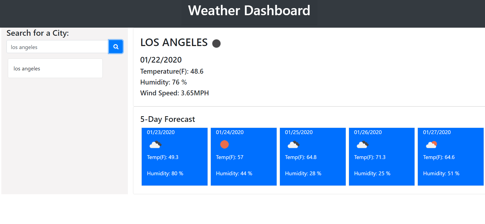

# Weather-Report

In this Weather Dashboard, the user is able to enter search for specific weather information regarding the city they type in.

The information provided in a 5-day forecast form are:
* Temperature
* Humidity
* Windspeed
* Weather Icon (Cloudy/Sunny/Rainy)

The search history is saved as a list on the left column as the user searches forecast information for other cities.

## Technologies Used
* HTML, Bootstrap/CSS, Moment.js, Javascript, jQuery, REST API, AJAX
* API from Open Weather

## Link
This app is deployed on GitHub Pages.
* https://jamieluong03.github.io/Weather-Report/